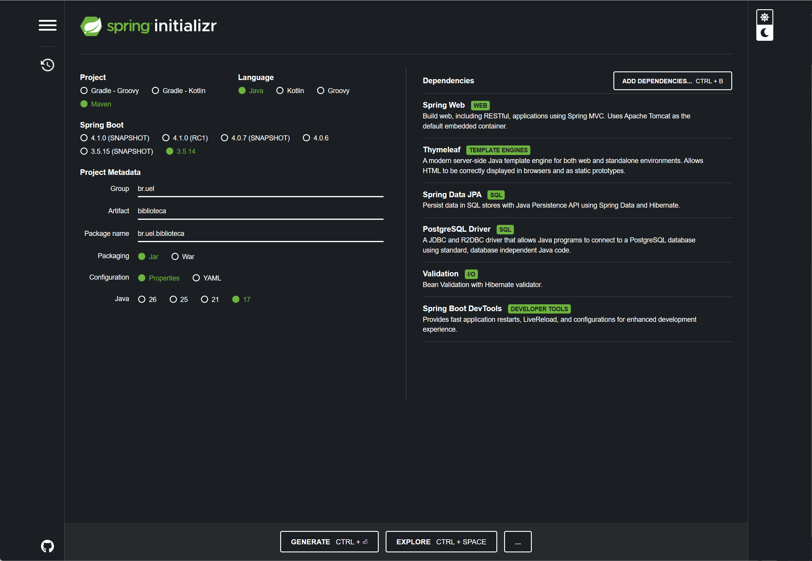
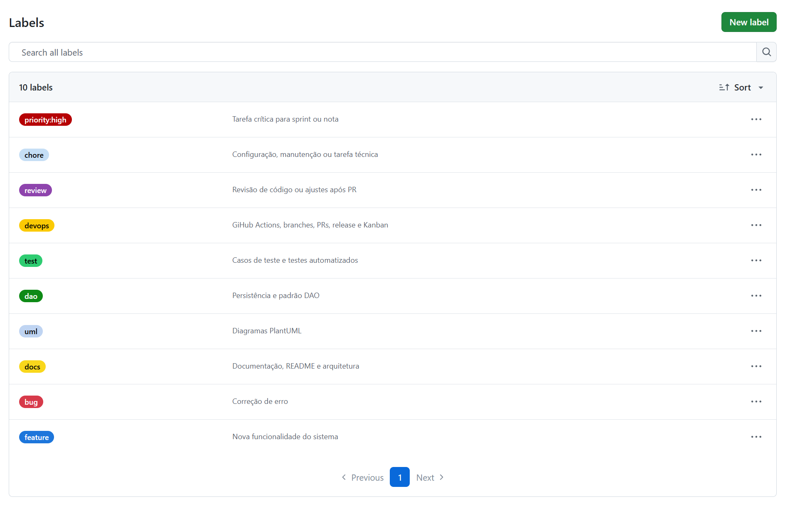
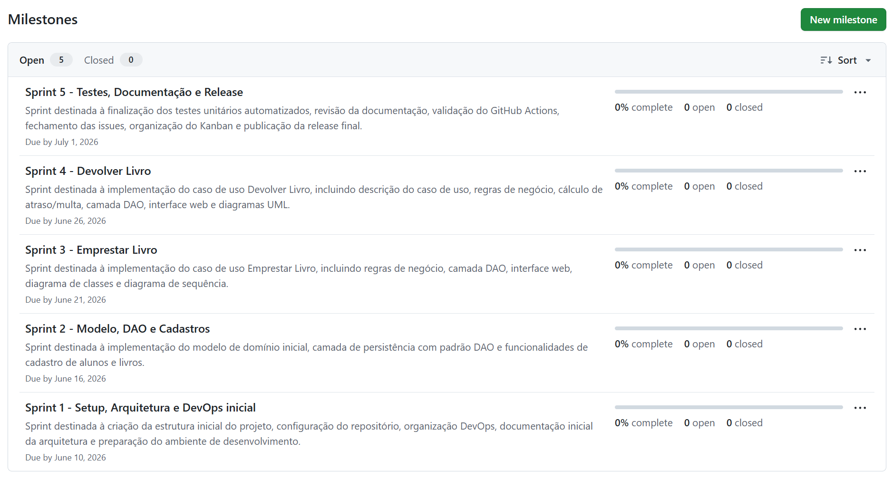
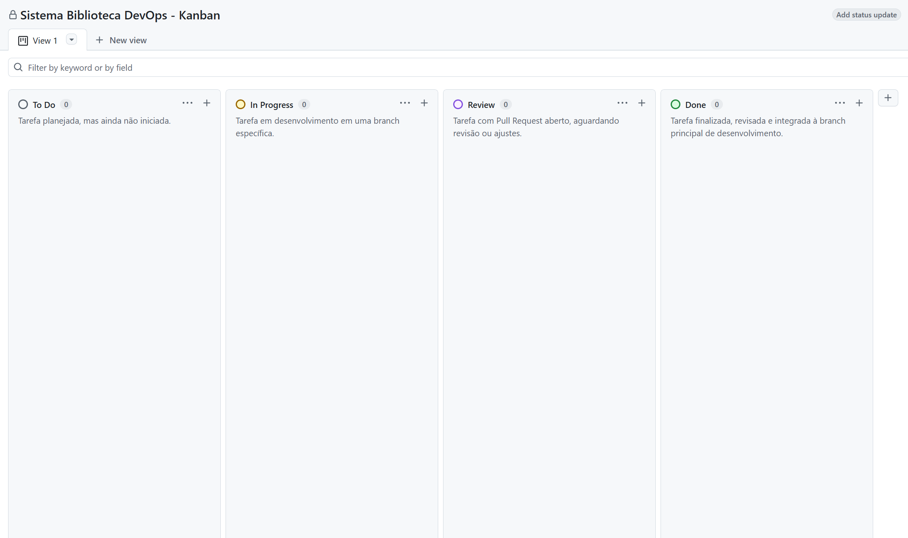
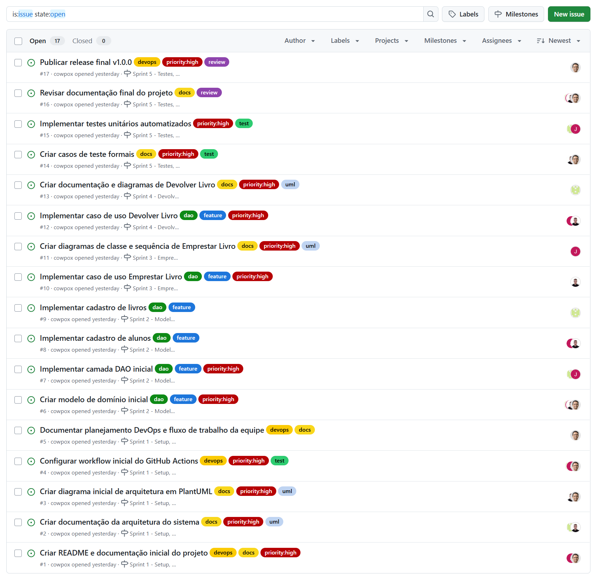

# Sistema Biblioteca — UEL Engenharia de Software

Trabalho final da disciplina de Engenharia de Software da Universidade Estadual de Londrina (UEL).

O sistema implementa as funcionalidades de empréstimo e devolução de livros de uma biblioteca universitária, aplicando os padrões de projeto e princípios de engenharia de software estudados ao longo da disciplina (GRASP, SOLID, padrão DAO, arquitetura em camadas, MVC).

---

## Tecnologias utilizadas

| Tecnologia | Versão / Papel |
|---|---|
| Java | 17 |
| Maven | Gerenciador de build e dependências |
| Spring Boot | 3.5.14 — base do servidor web embarcado |
| Spring Data JPA | Camada de persistência (JPA/Hibernate) |
| Spring Validation | Validação de entradas |
| PostgreSQL | Banco de dados de produção |
| H2 | Banco em memória para testes automatizados |
| Thymeleaf | Motor de templates para a interface web |
| PlantUML | Geração dos diagramas UML (`.puml`) |
| JUnit 5 | Testes unitários automatizados |
| GitHub Actions | Integração contínua (CI) |

---

## Estrutura do projeto

```
sistema-biblioteca-devops/
├── .github/
│   └── workflows/                  # CI: executa mvn test em todo PR para develop e main
├── docs/
│   ├── diagramas/                  # Diagramas PlantUML (.puml) e imagens geradas (.png)
│   ├── casos-de-uso/               # Descrição dos casos de uso (Emprestar Livro, Devolver Livro)
│   ├── evidence/                   # Screenshots de evidência do processo por sprint
│   ├── arquitetura.md              # Documentação da arquitetura do sistema
│   ├── devops.md                   # Fluxo DevOps, sprints e Kanban
│   ├── casos-de-teste.md           # 18 casos de teste formais
│   └── testes-unitarios.md         # Inventário dos testes unitários automatizados
├── src/
│   ├── main/
│   │   ├── java/br/uel/biblioteca/ # Código-fonte principal
│   │   │   ├── controller/         # Controllers Spring MVC
│   │   │   ├── service/            # Serviços com regras de negócio
│   │   │   ├── dao/                # Interfaces DAO e implementações
│   │   │   └── model/              # Entidades JPA
│   │   └── resources/
│   │       ├── templates/          # Views Thymeleaf (.html)
│   │       └── application.properties
│   └── test/
│       └── java/br/uel/biblioteca/ # Testes unitários JUnit 5
├── pom.xml
└── README.md
```

---

## Como clonar o repositório

```bash
git clone https://github.com/cowpox/sistema-biblioteca-devops.git
cd sistema-biblioteca-devops
```

Para acessar a branch de integração:

```bash
git checkout develop
```

---

## Pré-requisitos

- Java 17 instalado e configurado no `PATH`
- PostgreSQL em execução local (para rodar a aplicação completa)
- Maven não é necessário instalar separadamente — o projeto inclui o Maven Wrapper (`mvnw` / `mvnw.cmd`)

### Configurar o banco de dados

Edite `src/main/resources/application.properties` com as credenciais do seu PostgreSQL local:

```properties
spring.datasource.url=${DB_URL:jdbc:postgresql://localhost:5432/biblioteca}
spring.datasource.username=${DB_USER:postgres}
spring.datasource.password=${DB_PASSWORD:postgres}
spring.jpa.hibernate.ddl-auto=update
```

---

## Como executar os testes

Os testes utilizam banco H2 em memória e não requerem PostgreSQL.

**Windows:**
```cmd
mvnw.cmd test
```

**Linux / macOS:**
```bash
./mvnw test
```

---

## Fluxo de trabalho (Git Workflow)

O projeto adota um fluxo baseado em branches de funcionalidade com integração via `develop` e entrega final em `main`.

```
main          ← entrega final (release v1.0.0)
└── develop   ← branch de integração
    ├── feature/*   ← novas funcionalidades
    ├── docs/*      ← documentação e diagramas
    ├── test/*      ← casos de teste e testes automatizados
    └── fix/*       ← correções de bugs
```

**Regras:**
1. Todo desenvolvimento parte de uma branch derivada de `develop`.
2. Ao concluir, abrir Pull Request para `develop` com revisão de ao menos um integrante.
3. PR para `main` apenas na entrega final (tag `v1.0.0`).
4. O pipeline de CI executará automaticamente em todo Pull Request aberto contra `develop` ou `main` (configurado no Sprint 1).

---

## DevOps e organização do projeto

### Issues

Cada funcionalidade, documento ou tarefa técnica é rastreada por uma Issue no GitHub. Toda issue recebe:
- Label de categoria (`feature`, `bug`, `test`, `docs`, `devops`, `uml`, `dao`, `review`, `chore`)
- Label de prioridade (`priority:high` para a sprint corrente)
- Responsável (assignee)
- Milestone correspondente à sprint

### Kanban

O projeto utiliza GitHub Projects com as colunas:

`To Do` → `In Progress` → `Review` → `Done`

Cada issue é representada por um card. O card vai para `Done` apenas após o PR correspondente ser mergeado.

### Pull Requests e Code Review

Todo PR deve referenciar a issue relacionada e descrever as mudanças realizadas. Todo PR deve ser revisado por ao menos um integrante antes do merge. Ao longo do projeto, serão registradas no mínimo duas revisões formais de código entre os membros da equipe. O CI deve estar passando no momento do merge.

### GitHub Actions

O workflow `.github/workflows/ci.yml` executa `mvn test` automaticamente em todo Pull Request aberto contra `develop` ou `main`, garantindo que nenhuma alteração quebra o build ou os testes.

### Release

A entrega final é publicada como Release `v1.0.0` na branch `main`, com tag Git `v1.0.0` e descrição dos artefatos entregues. A Release consolida:

- Código funcional com todas as funcionalidades implementadas (cadastro, empréstimo, devolução)
- Diagramas UML finalizados (pacotes, domínio, classes e sequência)
- Documentação de arquitetura, casos de uso, casos de teste e testes unitários
- Workflow de CI configurado e executando com sucesso
- Kanban com todas as tarefas em `Done` e todas as Issues fechadas

---

## Documentação

A pasta `docs/` concentra toda a documentação técnica do projeto:

**Arquitetura e DevOps:**
- `docs/arquitetura.md` — visão conceitual, arquitetura em camadas, padrão MVC e DAO, atributos de qualidade
- `docs/devops.md` — fluxo de trabalho, sprints, Kanban, GitHub Actions e processo de release

**Casos de uso:**
- `docs/casos-de-uso/emprestar-livro.md` — descrição completa do CU Emprestar Livro com fluxos alternativos
- `docs/casos-de-uso/devolver-livro.md` — descrição completa do CU Devolver Livro com fluxos alternativos

**Implementação:**
- `docs/emprestar-livro.md` — detalhamento da implementação do CU Emprestar Livro
- `docs/modelo-dominio-inicial.md` — modelo de domínio e entidades
- `docs/camada-dao-inicial.md` — especificação da camada DAO
- `docs/persistencia.md` — configuração de persistência com JPA/Hibernate e PostgreSQL
- `docs/ui-inicial.md` — especificação inicial da interface gráfica

**Testes:**
- `docs/casos-de-teste.md` — 18 casos de teste formais (CT-EMP-01 a CT-EMP-10, CT-DEV-01 a CT-DEV-08)
- `docs/testes-unitarios.md` — inventário dos testes unitários automatizados (JUnit 5 + Mockito)

**Diagramas PlantUML** (`docs/diagramas/`):
- `arquitetura-pacotes.puml` — Diagrama de Pacotes (arquitetura do sistema)
- `modelo-dominio.puml` — Modelo de Domínio
- `der-modelo-inicial.puml` — Diagrama Entidade-Relacionamento
- `diagrama-classes-emprestar.puml` — Diagrama de Classes — Emprestar Livro (com camada DAO)
- `seq-emprestar-livro.puml` — Diagrama de Sequência — Emprestar Livro (Fig. 11.11 do livro de referência)
- `caso-uso-devolver.puml` — Diagrama de Caso de Uso — Devolver Livro
- `classe-devolver.puml` — Diagrama de Classes — Devolver Livro (com camada DAO)
- `sequencia-devolver.puml` — Diagrama de Sequência — Devolver Livro

**Evidências:**
- `docs/evidence/` — screenshots registrando o processo de desenvolvimento ao longo dos 5 sprints (PRs mesclados, CI em execução, Kanban e organização do repositório)

---

## Evidências do processo de desenvolvimento

As imagens abaixo documentam a configuração inicial do repositório GitHub realizada no Sprint 1. O conjunto completo de evidências, cobrindo do Sprint 1 ao Sprint 5, está disponível em `docs/evidence/`.

**Configuração do projeto no Spring Initializr**



**Labels configuradas no repositório**



**Milestones e Sprints criados**



**Kanban criado no GitHub Projects**



**Issues organizadas por sprint e label**



---

## Equipe

| Integrantes     |
|-----------------|
| Adriano Brandão |
| Herik Daurízio  |
| Júlia Massaki   |
| Sofia Gutschow  |

---

## Disciplina

Engenharia de Software — Universidade Estadual de Londrina (UEL)

Professor: André Menolli

Entrega: 04/07/2026
